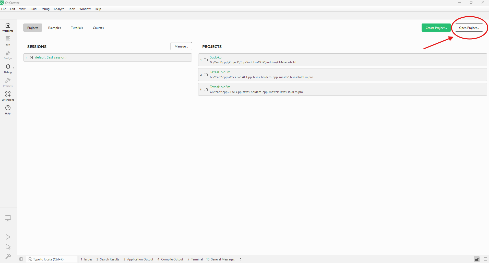
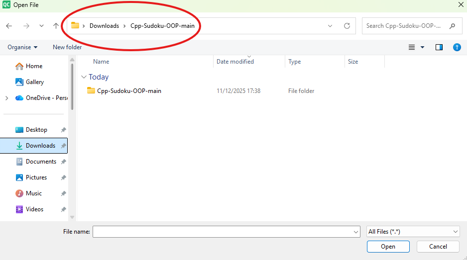
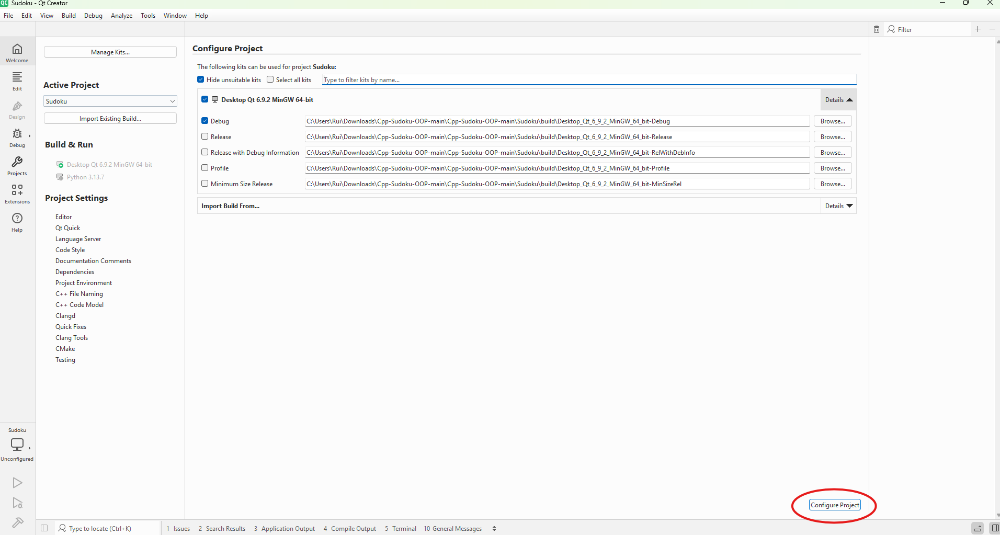
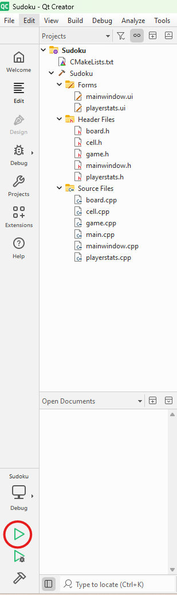
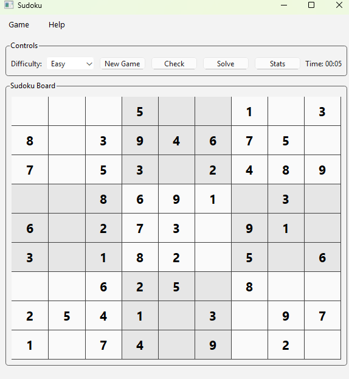

# How to run

## Option 1: Run the prebuilt version (recommended)

1. Go to the **Releases** page of this repository on GitHub.
2. Click the **newest release** (latest version at the top).
3. Under **Assets**, download the `.zip` file (for example: `Cpp-Sudoku-OOP-windows.zip`).
4. After the download finishes, **extract** the `.zip` file.
5. Open the extracted folder named `Desktop_Qt_6_9_2_MinGW_64_bit-Debug`.
6. Double-click `Sudoku.exe` to start the game.

> Note: Do not move `Sudoku.exe` out of this folder. It needs the `.dll` files and subfolders to run correctly.

---
## Option 2: Build and run in Qt Creator

### Requirements
- Qt Creator (with CMake and a C++ compiler installed)
- This repository cloned locally:

    ```console
    > git clone https://github.com/Anish-Pun/Cpp-Sudoku-OOP.git
    ```

---

### Steps

1. Open **Qt Creator**.

   

2. Click **Open Project** (top-right or `File → Open File or Project...`).

   

3. Navigate to the folder where you cloned the repository.

   

4. Select the file named **`CMakeLists.txt`** inside the `Sudoku` directory and open it.

   

5. When Qt Creator asks you to *Configure Project*, click **Configure**.

   

6. Click **Run** (the green **Play** button at the bottom left under `Debug (imported)`) to start the Sudoku application. This will also build the project if needed.

   

7. The Sudoku GUI should appear.

   
---